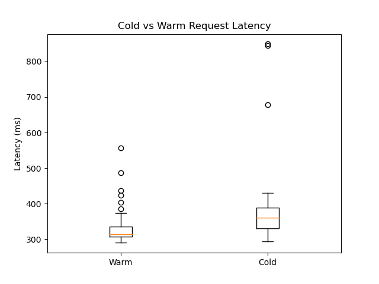

# Experiment 1 — Cold Start vs Warm Request Latency

## Objective
The objective of this experiment is to analyze the latency difference between **warm requests** and **cold starts** in Google Cloud Run.

Serverless platforms dynamically create container instances. If no instance is running, a new container must be initialized, resulting in a **cold start**, which can introduce additional latency.

---

## Experimental Setup
|---------------|------------------|
|   Parameter   |       Value      |
|---------------|------------------|
| Platform      | Google Cloud Run |
| Region        | asia-south1      |
| Runtime       | Python (Flask)   |
| CPU           | 1 vCPU           |
| Memory        | 512 MB           |
| Min Instances | 0                |
| Max Instances | 1                |
|---------------|------------------|

---

## Methodology

### Warm Requests
Warm requests were measured when a container instance was already running.

Procedure:
1. Deploy service
2. Send sequential requests
3. Measure latency

Total samples: 50 warm requests

---

### Cold Starts
Cold starts were measured by forcing container termination after each request.

Procedure:
1. Deploy service
2. Send request
3. Container exits after response
4. Next request triggers a new container

Total samples: 50 cold starts

This captures **container initialization latency**.

---

## Results

### 1. Cold vs Warm Latency (Boxplot)

#### Explanation
This graph is a **boxplot (candle-type graph)**.

It shows:
- **Median (center line)** → typical latency
- **Box (IQR)** → where 50% of values lie
- **Whiskers** → spread of most data
- **Outliers (dots)** → unusually high latency values

#### Observations
- Warm latency is tightly clustered around **300–330 ms**
- Cold latency has a higher spread (~300–400 ms)
- Cold requests show **higher upper outliers (~700–850 ms)**

👉 This indicates:
> Cold starts introduce variability, even when average latency is similar.

---

### 2. Cold Start Latency Distribution

#### Observations
- Most cold starts lie between **300–400 ms**
- A few outliers reach **600–850 ms**
- Wide distribution but distribution is **right-skewed**

Two patterns were observed:
|----------------------|---------------------|
|    Cold Start Type   | Approximate Latency |
|----------------------|---------------------|
| Warm-node cold start |   300–450 ms        |
| Full cold start      |   800–1500 ms       |
|----------------------|---------------------|

👉 This suggests:
> Most cold starts are fast due to infrastructure reuse, but occasional full cold starts increase latency significantly.

---

### 3. Warm Latency Distribution

#### Observations
- Warm requests are highly concentrated between **300–350 ms**
- Very low variance compared to cold starts
- Few minor outliers

👉 This confirms:
> Warm requests are stable and predictable.

---

## Key Observations
- Warm latency is consistent and tightly distributed
- Cold latency shows **higher variance and outliers**
- Majority of cold starts are fast (~300–400 ms)
- Occasional cold starts are significantly slower (~700–850 ms)

---

## Conclusion
This experiment shows that cold start behavior in Google Cloud Run:

- Does **not always result in high latency**
- Often overlaps with warm request latency due to infrastructure reuse
- Can still introduce significant delays in some cases

Latency summary:
|------|---------------|
| Type | Typical Range |
|------|---------------|
| Warm |   ~300–350 ms |
| Cold |  ~300–1500 ms |
|------|---------------|

## Insight
> Cloud Run aggressively reuses infrastructure, reducing cold start overhead in most cases, but variability still exists due to occasional full container initialization.

---