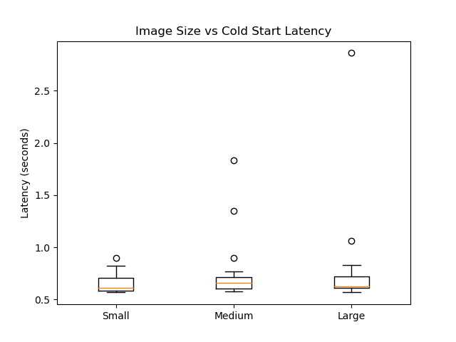
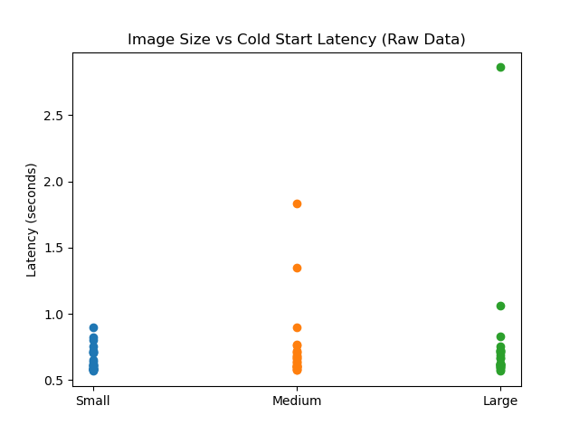

# Experiment 2 — Image Size vs Cold Start Latency

## Objective
The objective of this experiment is to analyze how container image size impacts cold start latency in Google Cloud Run.

Serverless platforms initialize containers on demand. Larger images require more time to download and initialize, which can increase cold start latency.

---

## Experimental Setup

|   Parameter   |       Value      |
|---------------|------------------|
| Platform      | Google Cloud Run |
| Region        | us-central1      |
| Runtime       | Python (Flask)   |
| CPU           | 1 vCPU           |
| Memory        | 512 MB           |
| Min Instances | 0                |
| Concurrency   | 1                |

---

## Methodology

### Image Configurations
Three container images of different sizes were created:

| Image Type     | Description                  |
|----------------|------------------------------|
| Small          | Minimal dependencies         |
| Medium         | NumPy, Pandas                |
| Large          | SciPy, OpenCV, Torch         |

All versions use identical application logic to ensure that only image size varies.

---

### Cold Start Measurement

Cold starts were measured by forcing instance termination between requests.

Procedure:
1. Deploy service
2. Send request
3. Wait 30 seconds (allow instance shutdown)
4. Send next request

Total samples: 20 cold starts per image

This captures container initialization latency for different image sizes.

---

## Results

### 1. Image Size vs Latency (Boxplot)

#### Explanation
This graph is a boxplot (candle-type graph).

It shows:
- Median (center line) → typical latency
- Box (IQR) → where 50% of values lie
- Whiskers → spread of most data
- Outliers (dots) → high latency cold starts

#### Observations
- Median latency is similar across all images (~0.6–0.7s)
- Larger images show higher outliers
- Maximum latency increases with image size (~2.8s for large)

This indicates:
Cold start latency increases with image size, while typical latency remains similar.

---

### 2. Raw Latency Distribution

#### Observations
- Most requests fall between 0.6s – 0.8s → warm execution behavior
- Higher values represent cold start events

- Upper range increases with image size:
  Medium → ~1.8s  
  Large → ~2.8s  

This shows:
Cold start overhead increases with container size.

---

## Key Observations
- Warm latency remains stable across all configurations
- Cold start latency increases with image size
- Larger images introduce higher variability and extreme values
- Majority of requests still fall within warm latency range

---

## Conclusion
This experiment shows that:

- Container image size has minimal effect on warm latency
- Cold start latency increases significantly with image size due to higher initialization overhead

Latency trend:

| Image     | Cold Start     |
|-----------|----------------|
| Small     | ~0.8–1.0s      |
| Medium    | ~1.0–2.0s      |
| Large     | ~1.5–3.0s      |

---

## Insight
Cold start latency in Cloud Run is primarily influenced by container image size due to image loading and initialization overhead, while steady-state execution remains largely unaffected.

---