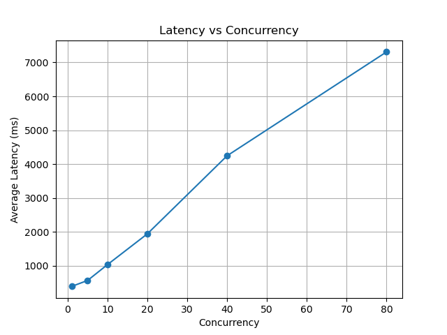
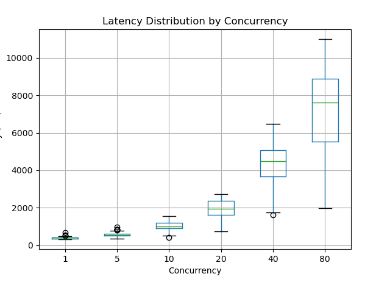
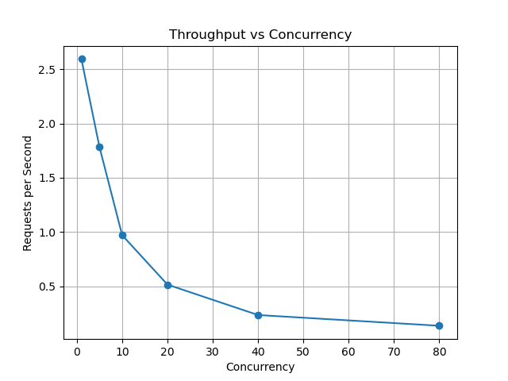

# Experiment 3 — Concurrency vs Latency in Cloud Run

## System Configuration
- Platform: Google Cloud Run (Fully Managed)
- Region: asia-south1 (India)
- Service Configuration:
  - Concurrency: 80
  - Max Instances: 10
- Application:
  - Framework: Flask (Python)
  - Server: Gunicorn (1 worker, 8 threads)
  - Simulated workload: ~50 ms per request

---

## Collected Data

### Average Latency per Concurrency Level

| Concurrency | Avg Latency (ms) |
|-------------|------------------|
|       1     |       385.67     |
|       5     |       561.46     |
|      10     |      1030.19     |
|      20     |      1938.60     |
|      40     |      4244.01     |
|      80     |      7310.93     |

---

## Objective
The objective of this experiment is to analyze how request latency and throughput change with increasing concurrency levels in Google Cloud Run.

---

## Methodology
- A Flask-based service was deployed on Cloud Run
- Each request simulates ~50 ms of processing delay
- A client script generated concurrent requests at different levels:
  
  1, 5, 10, 20, 40, 80

- For each concurrency level:
  - 100 requests were sent
  - Latency was recorded for each request
  - Data was stored in a CSV file for analysis

---

## Results & Analysis

### 1. Latency vs Concurrency

**Observation:**
- Gradual increase from concurrency 1 to 10  
- Sharp rise beyond 10  
- Extremely high latency at 40 and 80  

**Interpretation:**
Latency increases non-linearly with concurrency, indicating system saturation and request queuing within instances.

---

### 2. Latency Distribution (Boxplot)

**Observation:**
- Tight distribution at low concurrency  
- Increasing spread at medium levels  
- Large variance and long tails at high concurrency  

**Interpretation:**
Higher concurrency leads to unstable performance and significant tail latency due to queuing delays.

---

### 3. Throughput vs Concurrency

**Observation:**
- Highest throughput at low concurrency  
- Decreases as concurrency increases  
- Plateaus at higher levels  

**Interpretation:**
Increasing concurrency does not improve throughput and instead reduces efficiency due to internal queuing.

---

## Key Insights
- Cloud Run prioritizes utilizing existing instances before scaling new ones  
- High concurrency leads to request queuing within instances  
- Latency increases significantly beyond moderate concurrency (~10–20)  
- Throughput does not scale proportionally with concurrency  
- Optimal performance exists at moderate concurrency levels  

---

## Conclusion
Although Cloud Run supports high concurrency per instance, increasing concurrency leads to higher latency and reduced throughput due to internal request queuing.

Optimal performance is achieved at moderate concurrency levels where system efficiency and latency are balanced.

---