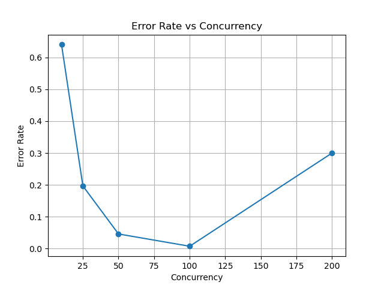
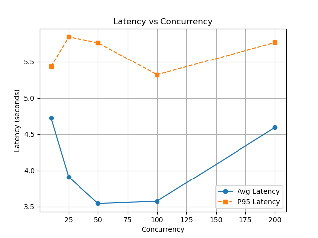
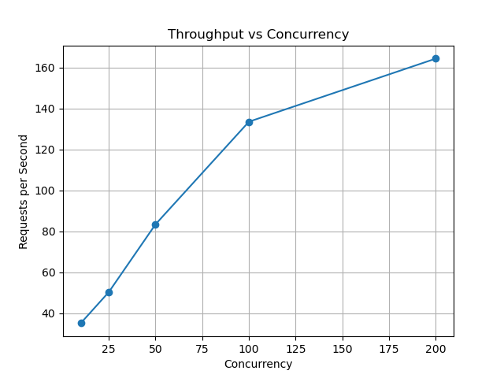

# Experiment 4 — Autoscaling Limits & Saturation Behavior

## Objective
The objective of this experiment is to analyze how a serverless service behaves under increasing load, focusing on:

- Autoscaling response
- Latency under pressure
- Error rates at high concurrency
- Maximum sustainable throughput

---

## System Setup

- Platform: Google Cloud Run  
- Region: us-central1  
- Concurrency per instance: 10  
- Max instances: 5  
- Simulated processing time: 0.2 seconds  

The service is intentionally constrained to observe saturation effects.

---

## Methodology

The service was tested using an asynchronous load generator with increasing concurrency levels:

| Concurrency | Requests |
|-------------|----------|
|      10     |    200   |
|      25     |    300   |
|      50     |    500   |
|     100     |    800   |
|     200     |   1000   |

Metrics recorded:
- Average latency
- P95 latency
- Error rate
- Throughput (requests per second)

---

## Analysis

### 1. Error Rate vs Concurrency

At low concurrency (10), the system shows a high error rate (~65%), indicating delayed autoscaling or insufficient initial instances.

As concurrency increases (25–100), the error rate drops significantly, showing that the system stabilizes as more instances are provisioned.

At high concurrency (200), the error rate rises sharply (~30%), indicating system saturation and capacity limits.

---

### 2. Latency vs Concurrency

Latency is high at low concurrency due to cold starts and queueing delays.

Between 25–100 concurrency, latency stabilizes (~3.5s), representing efficient load distribution.

At 200 concurrency, latency increases again due to request backlog and resource exhaustion.

P95 latency remains consistently high (~5–5.8s), highlighting tail latency issues in distributed systems.

---

### 3. Throughput vs Concurrency (Experiment 4)

Throughput increases steadily as concurrency rises, showing effective horizontal scaling.

However, growth slows and plateaus near ~160 req/s, indicating a hard system limit due to max-instances constraint.

---

## Comparison with Experiment 3 (Key Insight)

### 🔵 Experiment 3 — Single Instance (No Autoscaling)

- Throughput decreases as concurrency increases  
- Caused by resource contention within a single instance  
- Demonstrates vertical scaling limits  

---

### 🔴 Experiment 4 — Autoscaling Enabled

- Throughput increases with concurrency initially  
- Cloud Run scales horizontally by adding instances  
- Eventually plateaus due to max-instances limit  

---

### Core Difference
- Experiment 3 → **Single instance overload → degradation**  
- Experiment 4 → **Multiple instances scale → growth → saturation**  

This clearly demonstrates the difference between:
- Vertical scaling limits (Exp 3)
- Horizontal autoscaling behavior (Exp 4)

---

## Key Insights
- Autoscaling is not instantaneous and introduces initial instability  
- There exists a stable operating region where performance is optimal  
- System performance degrades sharply beyond capacity limits  
- Throughput increases with load until saturation plateau  
- Tail latency remains a critical concern under load  

---

## Conclusion
This experiment demonstrates real-world serverless behavior, including:

- Delayed autoscaling response  
- Efficient scaling under moderate load  
- Saturation effects under high load  
- Persistent tail latency challenges  

The results provide practical insights into performance limits and scaling dynamics in serverless environments.

---