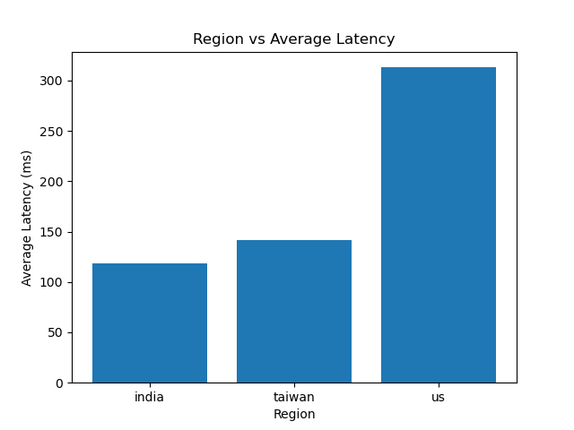
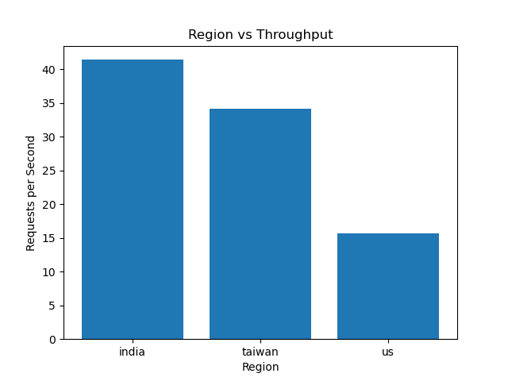

# Experiment 5 — Regional Latency Analysis

## Objective
The objective of this experiment is to analyze how deployment region affects latency and throughput in Google Cloud Run.

Even with identical application code and infrastructure, the geographic distance between client and server introduces network delays that significantly impact performance.

---

## System Setup
- Platform: Google Cloud Run  
- Regions Tested:
  - asia-south1 (India)
  - asia-east1 (Taiwan)
  - us-central1 (US)
- Load Testing Tool: hey  
- Requests: 100  
- Concurrency: 5  
- Client Location: India  

---

## Architecture Overview
The same containerized application is deployed across multiple regions.  
Requests are sent from a single client machine to each region, and performance metrics are recorded.

---

## Results

### Region vs Average Latency

**Observations:**
- India region shows the lowest latency (~120 ms)
- Taiwan region shows moderate latency (~140 ms)
- US region shows the highest latency (~315 ms)

---

### Region vs Throughput

**Observations:**
- Throughput is highest in India (~41 req/sec)
- Throughput decreases in Taiwan (~34 req/sec)
- Throughput is lowest in US (~15 req/sec)

---

## Key Insights
- Latency increases with geographic distance between client and server  
- Throughput decreases as latency increases  
- Network delay dominates performance even when compute resources are identical  

---

## Exp3 vs Exp5 Comparison
| Experiment | Bottleneck |
|------------|------------|
| Exp3 (Concurrency vs Latency) | CPU / Container limits |
| Exp5 (Regional Latency) | Network distance |

This demonstrates that system performance is influenced by both compute and network factors.

---

## Conclusion
Even with identical compute resources, network latency due to geographic distance significantly impacts system performance. Choosing the correct deployment region is critical for optimizing both latency and throughput in distributed applications.

---